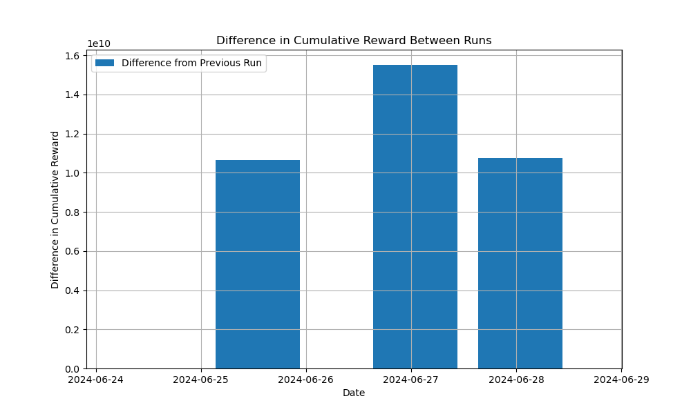

# Lightning Network node (LND) management tools

Scripts to automate management of channel fees and rebalancing of unbalanced channels for LND Lightning Network nodes

Date: 6/28/2024

Fulmine Labs LLC

## Overview

Two scripts and supporting tools have been implmented that can help to automate node management for LND Lightning Network noderunners.

## Warning

> :warning: **Warning**:  
> As these scripts are designed to make decisions involving real-world Satoshis/Bitcoin/$s/name-your-poison, they should be used with great care and only after thorough testing in your environment.
> They interface with the node via 'lncli', but make sure to backup your node data before running the scripts.
> The scripts are currently an early version and are still under test on my own node.
> Fulmine Labs LLC is not responsible for any losses incurred as a result of running these scripts.

## Details

The scripts are intended to be run at a Linux command line (or from a cron job) on the node itself, and do the following:

[rebalance.py](rebalance.py)

Rebalance channels that have more than a specified percentage of the channel balance on one side or the other with channels that are in the opposite situation, by attempting to send funds from one channel to the other. The amount can be specified.

A starting fee for each rebalance attempt can also be specified, along with a incremet to the current fee if unsuccessful and a decrement to the current fee if successful, thereby (one hopes) seeking and finding the 'Goldilocks' rebalancing fee.

The script will iterate overall eligible channel pairs and then repeat with that fee increment or decrement, for a specified number of times or until all channels are balanced.

[fee_setting_agent.py](fee_setting_agent.py)

This script can be run in two modes:

* Rule based: routing fees are increased, by a specified amount, on channels that have a preponderance of outbound routing. Routing fees are dencreased, by a specified amount, on channels that have a preponderance of inbound routing or no routing (experimental).

* Q-learning: after running the rule based version for a while and gathering some date, the script can be switched to Q-learning, which tries to maximize a reward based on routing fees collected as well as overall transactional volume on that channel (very experimental)

The data collected in both of these modes is collected to a CSV file, which can be analysed by running [analyze_fee_adjustments.py](analyze_fee_adjustments.py) in Jupyter Notebook or at the command line.

The analysis script will read the CSV data and trend the overall rewards for the system allowing a quick overview of how successful or otherwise it is.

## Datasources used

N/A

## Current Version
The current stable version of the project is 0.1
See the [CHANGELOG.md](CHANGELOG.md) file for details about this version.

## Prerequisites

* Python 3.6 or above
* Anaconda, with an environment having, pandas and matplotlib installed (only needed for graphical analysis)

## Usage

* Install Anaconda, create an environment and install the dependencies in requirements.txt
* Obtain all Files and folders from this repository from github
* These parameters can be modified in rebalance.py
  
  max_fee = 150             # Initial fee limit, in satoshis. Align with the invoice_size below.
  
  invoice_size = 500000     # Size of the invoice to create for rebalancing, in satoshis. Suggest 5-10% of your average channel size. Lower will succeed more often.
  
  force = "--force"         # Force the payment to be sent, even if it is risky
  
  timeout = "15s"           # Timeout for each payment attempt
  
  fee_increment = 10        # Increment value for fee limit if rebalancing fails for all unbalanced channels, in satoshis
  
  fee_decrement = 5         # Decrement value for fee limit if rebalancing succeeds on any unbalanced channel, in satoshis
  
  TOLERABLE_HIGH_RATIO = 3      # Local/remote ratio above which a channel is considered overbalanced locally - 1 is ideal
  
  TOLERABLE_LOW_RATIO = 0.33    # Local/remote ratio below which a channel is considered underbalanced locally - 1 is ideal
  
  SUCCEEDED_MAX = 20            # Maximum number of successful rebalances in total (limit your total spend)
  
  ATTEMPTED_MAX = 250           # Maximum number of rebalance attempts for all unbalanced channel pairs
  
* These parameters can be modified in fee_setting_agent.py

  DEBUG = True               # write copious output for troubleshooting
  
  PROMPT = True              # Set this to False to disable user prompts for unattended execution
  
  QTABLE = True              # Set to True to use Q-Learning, False to use rule-based adjustments. Suggest running for a few days set to False.
  
  LNCLI_PATH = "/usr/local/bin/lncli"  # Adjust this path as necessary for your LND installation
  
  AGGREGATION_DAYS = 7       # Number of days to aggregate forwarding history, when determining if there is more inbound or outbound traffic
  
  DATA_FILE = "fee_adjustment_data.csv"  # File to store data for AI training and trend analysis
  
* Run from the command line, (setting DEBUG To True and Prompt to True for fee_setting_agent.py) to ensure that the scripts are behaving as expected: _python script_name.py_
* Once working, these scripts can be from a cron job, and log output for troubleshooting, using 'crontab -e'. Cron entries might look something like this:
      - update required
* The trend analysis script can be run as _python analyze_fee_adjustments.py_. It expects the CSV file _fee_adjustment_data.csv_ to be present in the local folder and will create a plot called _difference_in_cumulative_reward_between_runs.png_

## Testing

The rebalance.py script has been tested for several weeks. It will sometimes find a sweet spot and rebalance a number of times in one run, for an average fee of around 400 sats for 1M sats rebalanced. Sometimes it will not rebalance any channels.

The fee_setting_agent.py script has only run for a few days, at this time. Initial fee setting bugs seem to have been ironed out, but it is still very much in POC. My best guess from initial observations, is that the rule-based mode is directionally good, but the Q-learning mode needs work.

Feedback is welcome on both.

## Known issues and roadmap

* Eventually the Q-learning should also vary the size of the increment/decrement
* Ignoring fees to open channels or replace hardware, for a node, _profit = routing fees - rebalancing fees_. Therefore a future version of the Q-learning script could include the rebalancing fees/parameters in the reward/actions

## Acknowledgements

This code was written collaboratively with [GPT-4V](https://chat.openai.com/). Thank you Assistant!

## License
MIT open source license

## Collaboration
We welcome contributions at all levels of experience, whether it's with code, documentation, tests, bug reports, feature requests, or other forms of feedback. If you're interested in helping improve this tool, here are some ways you can contribute:

Ideas for Improvements: Have an idea that could make these Lightning Network node channel management scripts better? Open an issue with the tag enhancement to start a discussion about your idea.

Bug Reports: Notice something amiss? Submit a bug report under issues, and be sure to include as much detail as possible to help us understand the problem.

Feature Requests: If you have a suggestion for a new feature, describe it in an issue with the tag feature request.

Documentation: Good documentation is just as important as good code. Although this is currently a very simple tool, if you'd like to contribute documentation, we'd greatly appreciate it.

Code: If you're looking to update or write new code, check out the open issues and look for ones tagged with good first issue or help wanted.

## Contact
Duncan Henderson, Fulmine Labs LLC henderson.duncanj@gmail.com
